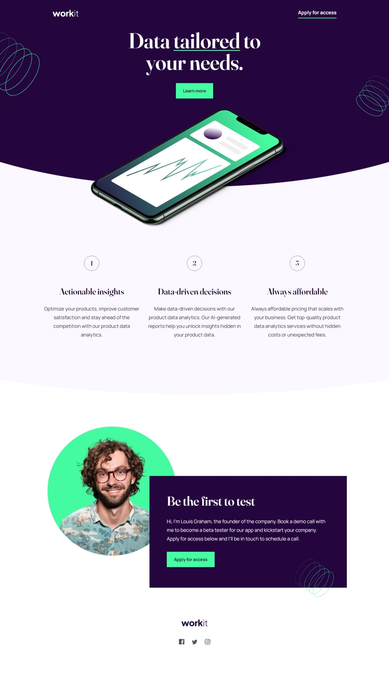

# Frontend Mentor - Workit landing page solution

This is a solution to the [Workit landing page challenge on Frontend Mentor](https://www.frontendmentor.io/challenges/workit-landing-page-2fYnyle5lu). Frontend Mentor challenges help you improve your coding skills by building realistic projects.

## Table of contents

- [Overview](#overview)
    - [The challenge](#the-challenge)
    - [Screenshot](#screenshot)
    - [Links](#links)
- [My process](#my-process)
    - [Built with](#built-with)
    - [What I learned](#what-i-learned)
- [Author](#author)

## Overview

### The challenge

Users should be able to:

- View the optimal layout for the interface depending on their device's screen size
- See hover and focus states for all interactive elements on the page

### Screenshot

### Links

- Solution URL: [Frontend Mentor Solution Page](https://www.frontendmentor.io/solutions/supertricky-landingpage-with-multilayered-design-QkxFFZNl0i)
- Live Site URL: [Hosted on GitHub Pages](https://aleknovkovski.github.io/FEM-workit-landing-page/working/)

## My process

### Built with

- Semantic HTML5 markup
- CSS custom properties
- Flexbox

### What I learned

#### I learned to create multi-layered designs combining ::before and ::after as well as z-index

This challenge involved a pretty tricky effect where you have:
- A section which ends in a divider
- You have an element (the smartphone) that should lay on top of the divider
- And you have these graphical elements in the background which exist in between the section background and the content

Trying to do each of these using a conventional and intuitive method is relatively straightforward. It's combining the 3 at the same time that requires an unconventional approach.

So the solution here involved setting a section::after pseudo-element which is set at 100% height and width. So it will be the same size as the section it's attached to. 

In order get the divider effect we applied border effects (border-radius: 0 0 80% 80%) to get curved bottom.

We then set the ::after pseudo-element to a z-index of minus-1 which allows us to create the layered situation. And we set the section itself to a z-index of one.  

So somehow this produces a layered effect that you wouldn't expect entirely. The content itself (at z-index 1) is above the content of the ::after pseudo element. However, what you wouldn't expect is that the background (color or images) of section ends BEHIND the content of ::after (as if it were a -2 later) 

 

In a "graphical sense", the layers end up like so

>SectionBackground | {-2}

>Section::After | (-1)

>SectionContent | (1)

-* By {-2} I mean that it acts as if it were a -2 in depth.

Next, in order to add graphical elements in the section, you create a ::before. Same logic as the ::after, except we're not setting the z-index on this one. With this the ::before pseudo-element will exist on top of the main section content. In a graphical sense it will act like a level +2 in depth. In graphical terms we get the following:

>SectionBackground | {-2}

>Section::After | (-1)

>SectionContent | (1)

>Section::Before | (2)

Since this will act as if it were a layer on top of the content, we set it to a transparent background to make sure the content behind it is visible. We'll only use this layer to set graphical shapes utilizing background-image.

Note also that since this (::before) is now a layer covering the content-layer, any clickable stuff inside the content layer becomes unclickable. So we have to add a (pointer-events: none) line to the ::after layer, if we want stuff to be clickable on the content-level layer.

## Author

- Frontend Mentor - [@aleknovkovski](https://www.frontendmentor.io/profile/aleknovkovski)
- Linkedin - [@aleknovkovski](https://www.linkedin.com/in/aleknovkovski/)