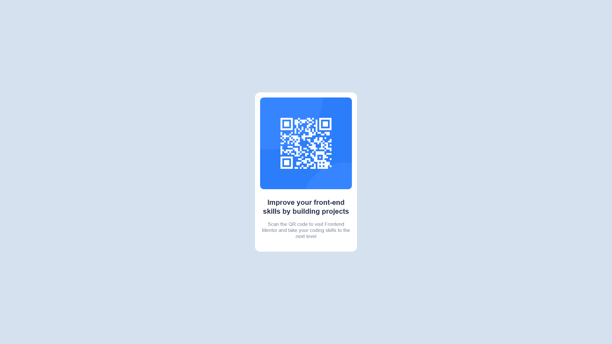

# Frontend Mentor - QR code component solution

This is a solution to the [QR code component challenge on Frontend Mentor](https://www.frontendmentor.io/challenges/qr-code-component-iux_sIO_H). Frontend Mentor challenges help you improve your coding skills by building realistic projects. 

## Table of contents

- [Overview](#overview)
  - [Screenshot](#screenshot)
  - [Links](#links)
- [My process](#my-process)
  - [Built with](#built-with)
  - [What I learned](#what-i-learned)
  - [Continued development](#continued-development)
  - [Useful resources](#useful-resources)
- [Author](#author)

## Overview

### Screenshot

Desktop

Mobile

### Links

- Solution URL: [Add solution URL here](https://your-solution-url.com)
- Live Site URL: [Add live site URL here](https://your-live-site-url.com)

## My process

### Built with

- HTML
- CSS

### What I learned

Revised a few topics.

### Continued development

Make more identical websites to the designs.

### Useful resources

- MDN Docs

## Author

- Website - [Ayush](https://www.byzackozack.in/)
- Frontend Mentor - [@zaCKoZAck0](https://www.frontendmentor.io/profile/zaCKoZAck0)
- Twitter - [@TechIcecone](https://twitter.com/TechIcecone)

